# Oscilloscope Measurements of Motor Phases

This repository contains oscilloscope measurements of the motor phases using a drill. The drill has two gears, referred to as gear 1 (slow) and gear 2 (fast). Therefore, all files are named with the motor type followed by `_fast` or `_slow` to indicate the corresponding gear.

## Purpose of Measurements

The measurements were conducted to determine the harmonic distortion of the motors. By analyzing the phase data under different gear settings, we can assess the performance and efficiency of the motors.

### Explanation of Files

- **`<Motor_Type>_fast/`**: Contains measurements taken with the drill set to gear 2 (fast ~1300 RPM).
- **`<Motor_Type>_slow/`**: Contains measurements taken with the drill set to gear 1 (slow ~380 RPM).

### Measurements Overview

The following table provides an overview of the oscilloscope measurements for different motor types, displaying images for both slow and fast gears.

| Motor Type        | Slow Gear (Gear 1) Image                          | Fast Gear (Gear 2) Image                          |
|-------------------|---------------------------------------------------|---------------------------------------------------|
| Axi2814-20        | 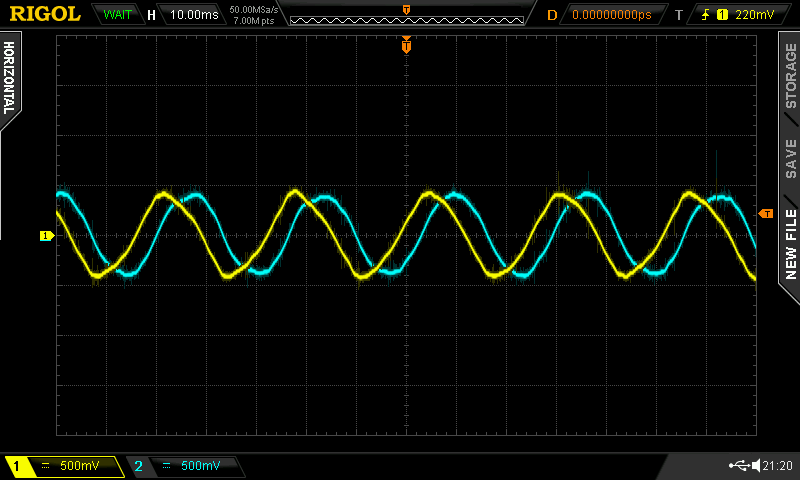 | 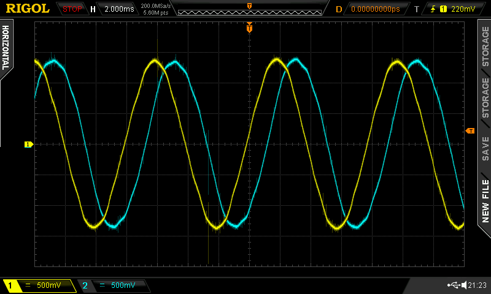 |
| Axi2814-28        | 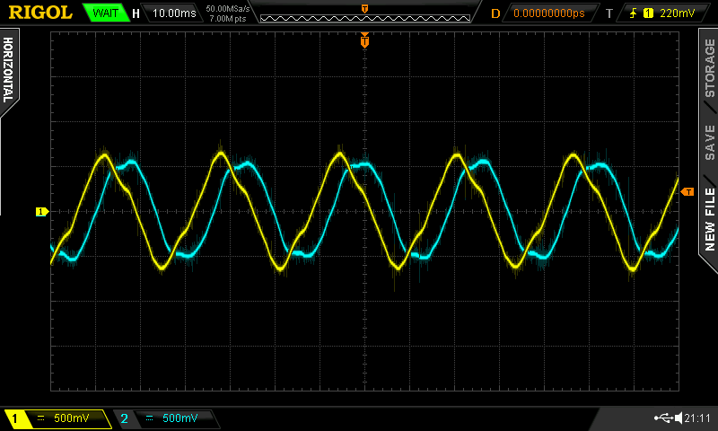 | 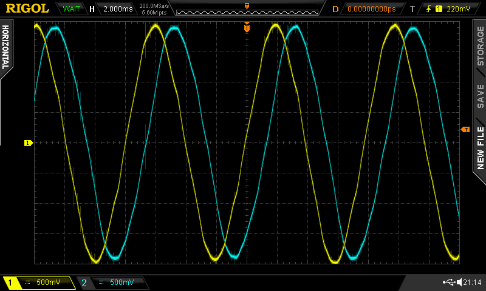 |
| Axi2826-10        | 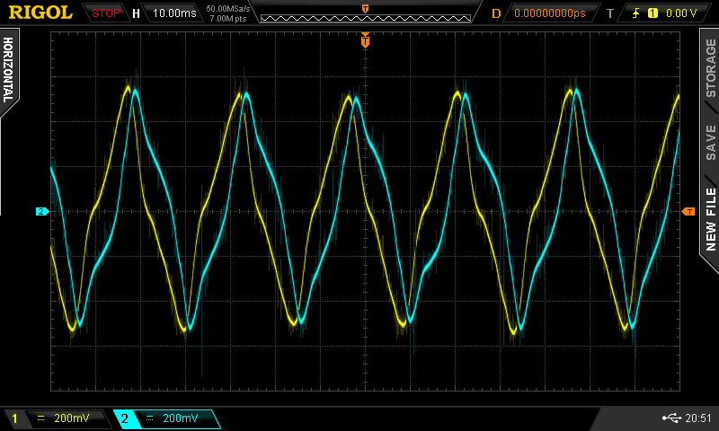 | 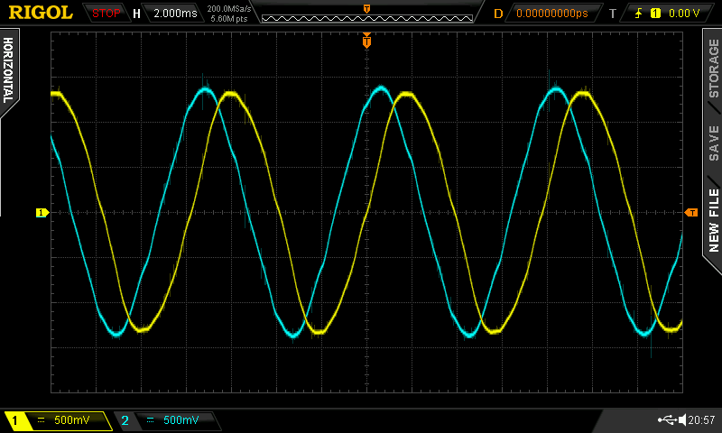 |
| df45l024053-a2    | 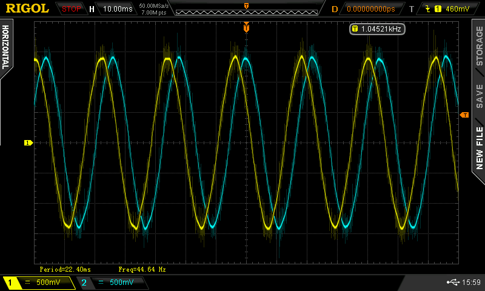 |  |
| df45m024053-a2    | 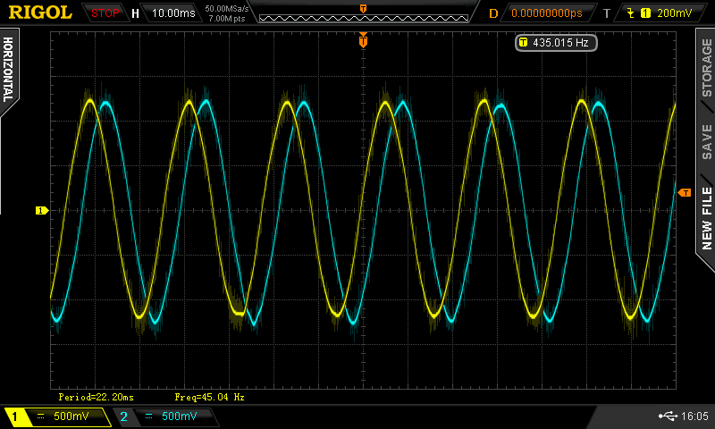 | 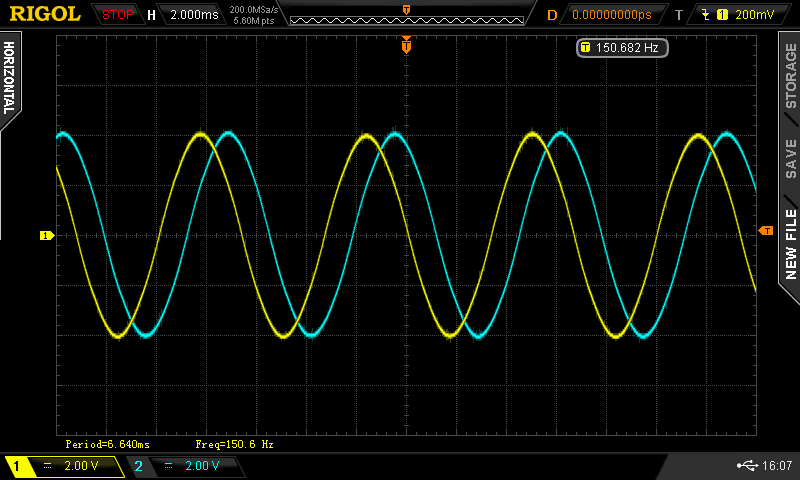 |
| MN4006            | 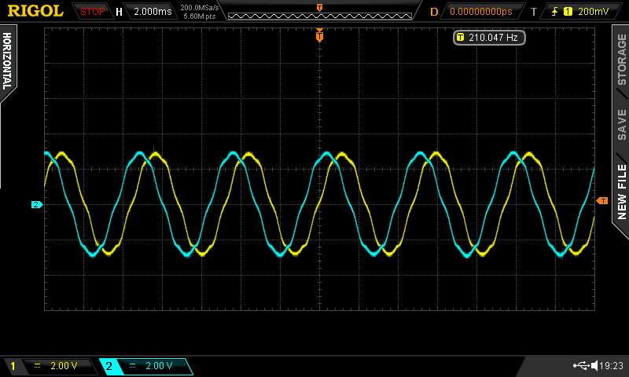         | 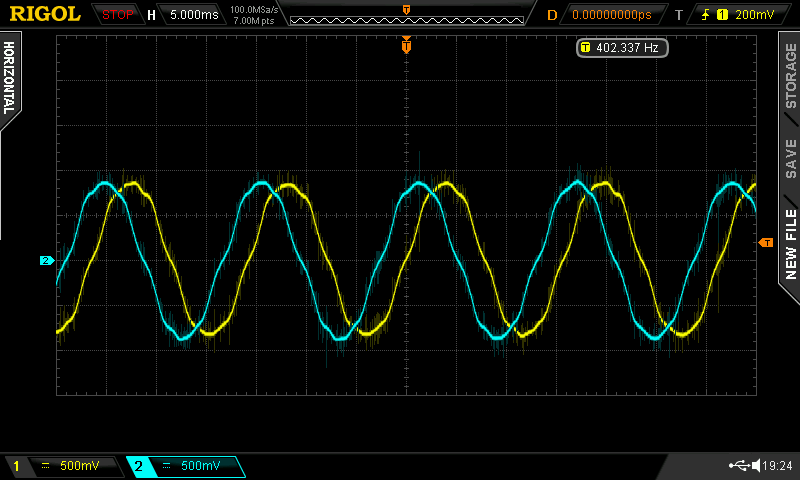         |
| MN5006            | 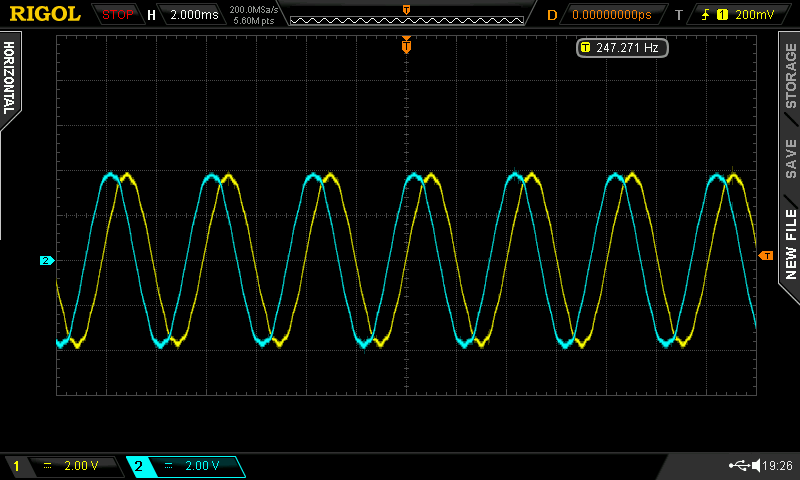         | 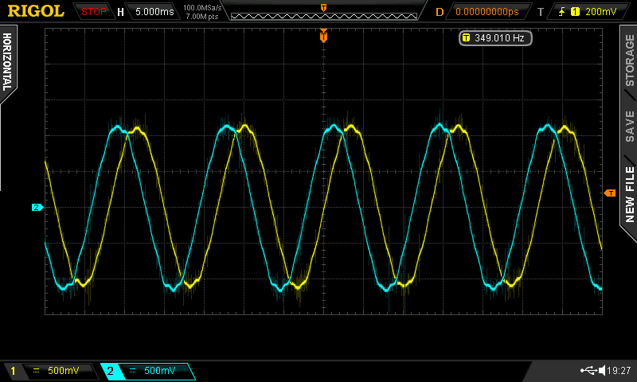         |
